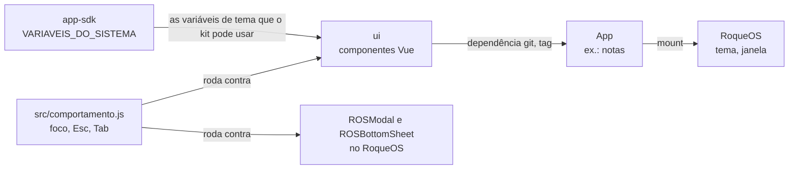

# ui

O kit de interface dos apps do [RoqueOS](https://roqueos.com.br): o ícone pelo nome, o botão,
o interruptor, a folha de ajustes, a confirmação e o estado vazio, para um app que mora fora
do RoqueOS parecer e se comportar como um de dentro. Só Vue: sem Quasar e sem nada do
RoqueOS.

_English below._

## Por que existe

Os apps do RoqueOS estão saindo do repositório do sistema, que é fechado, para repos próprios
na organização [roqueos-apps](https://github.com/roqueos-apps), falando com ele pelo
[`app-sdk`](https://github.com/roqueos-apps/app-sdk). Dentro do RoqueOS eles desenhavam a tela
com os componentes do sistema (`ROSModal`, `ROSBottomSheet`, `q-icon`), que dependem do Quasar
e das stores; fora, esses componentes não existem. Este kit é o que eles usam no lugar.

Ele nasceu com as Notas (Onda 4a do Goal 28, 27/09/2026) e cresce com o próximo app que
precisar de mais: componente sem app que o use não se testa contra uso real.

## Arquitetura



- O app instala o kit como dependência git pinada por tag, e o Vite do RoqueOS compila o
  fonte, como compila o app.
- As cores vêm do tema do RoqueOS pelas variáveis que o contrato do `app-sdk` lista
  (`--ros-fill-rgb`, `--ros-text-rgb`...), sempre com um valor de reserva, para o app ficar
  igual no `yarn dev`, fora do RoqueOS. A cor do app entra por prop (`acento`).
- O texto de cada componente vem por prop, já no idioma do app. O kit não tem idioma.

## Os componentes

| Componente       | Para quê                                                               | O que garante                                                                                                                    |
| ---------------- | ---------------------------------------------------------------------- | -------------------------------------------------------------------------------------------------------------------------------- |
| `RosIcone`       | ícone do Material Icons pelo nome (`nome`)                             | os traços da fonte que o RoqueOS usa; nome fora de `ICONES` é aviso do Vue; decorativo                                           |
| `RosBotao`       | `primario`, `fantasma` ou `perigo`                                     | botão só de ícone leva `rotulo` como `aria-label`; alternar (`ligado`) diz `aria-pressed`                                        |
| `RosInterruptor` | liga e desliga (`v-model`)                                             | `role="switch"` com `aria-checked`; Espaço, Enter e o OK da TV alternam; anda ao contrário em RTL                                |
| `RosFolha`       | ajustes e escolhas, subindo de baixo                                   | diálogo modal com título; foco entra, fica e volta; Esc, véu, fechar e a alça arrastada para baixo fecham                        |
| `RosConfirmar`   | a pergunta antes do que não tem volta                                  | `alertdialog`; abre com o foco no Cancelar; Esc e véu cancelam; `perigo` pinta de vermelho                                       |
| `RosVazio`       | o estado vazio ("Nenhuma nota ainda"), e o carregando com `carregando` | `role="status"`, ícone na cor do app, ação no slot; `carregando` põe a barra que corre (parada com `leve` ou movimento reduzido) |

`prenderFoco(el)` e `focaveis(el)` também saem do pacote, para o app que precisar prender o
foco num painel próprio.

### O que o kit não faz, de propósito

A folha e a confirmação moram **dentro da raiz do app** (que precisa de `position: relative`)
e cobrem a janela do app, não a tela. O kit nunca mexe no `document`: nenhum estilo no `body`,
nenhum listener no `document` ou na `window`, nenhum Teleport. O RoqueOS trava a rolagem do
`body` com um contador próprio quando abre um modal dele; um kit que também mexesse ali
destravaria a rolagem do sistema por baixo de um modal aberto. O Esc de uma folha aberta
também não sobe: com a folha aberta, o Esc é dela, não da janela.

### O mesmo comportamento dos dois lados

O RoqueOS continua com os componentes dele, e as duas famílias precisam se comportar igual.
[`src/comportamento.js`](src/comportamento.js) é o contrato de comportamento executável de uma
sobreposição: é diálogo modal para o leitor de tela, o foco entra ao abrir, o Esc fecha, o
foco volta para quem abriu, e o Tab não sai dela. O kit passa em tudo; o RoqueOS roda o mesmo
pacote contra o `ROSModal` e o `ROSBottomSheet`, e o que um lado ainda não cumpre fica
escrito, com o motivo, na lista `pular` do teste dele.

```js
import { describe, test, expect } from 'vitest'
import { testarSobreposicao } from '@roqueos-apps/ui/comportamento'

testarSobreposicao({ describe, test, expect }, { nome: 'RosFolha', montar })
```

O que nenhum teste automático cobre é o aparelho: o foco com o D-pad da TV e a folha com o
teclado do iPhone aberto entram no QA de aparelho de cada app.

## Como usar num app

```json
{ "dependencies": { "@roqueos-apps/ui": "github:roqueos-apps/ui#v0.1.0" } }
```

Enquanto o repo for privado, o atalho `github:` (que baixa por HTTPS) não entra sem token, e
quem instala usa a chave SSH: `"git+ssh://git@github.com/roqueos-apps/ui.git#v0.1.0"`. É o
que as Notas e o RoqueOS fazem hoje. Sempre por tag, nunca por branch.

```vue
<template>
  <div class="meu-app">
    <RosVazio v-if="vazio" icone="sticky_note_2" :titulo="t('vazio')" acento="#f59e0b" />
    <RosFolha v-model="ajustes" :titulo="t('ajustes')" :rotulo-fechar="t('fechar')">
      <RosInterruptor v-model="naMesa" :rotulo="t('naMesa')" acento="#f59e0b" />
    </RosFolha>
  </div>
</template>

<script setup>
import { RosFolha, RosInterruptor, RosVazio } from '@roqueos-apps/ui'
</script>

<style>
.meu-app {
  position: relative; /* a folha e a confirmação se prendem aqui */
}
</style>
```

## Pré-requisitos

- Node 22 ou mais novo (o `.nvmrc` diz 24).
- Yarn 1 (`packageManager` no `package.json`).

## Como rodar

```bash
yarn install --ignore-scripts
yarn verificar   # lint, formato, testes e app check --sdk, o mesmo do CI e do pre-push
yarn dev         # a vitrine, com cada componente nos estados que importam (?dir=rtl para o árabe)
node scripts/icones.mjs <caminho do @quasar/extras> nome_do_icone   # ícone novo
```

## Estrutura

```text
src/
  index.js          o que o pacote exporta
  RosIcone.vue      RosBotao.vue  RosInterruptor.vue  RosFolha.vue  RosConfirmar.vue  RosVazio.vue
  icones.js         os ícones (gerado por scripts/icones.mjs)
  foco.js           prenderFoco e focaveis, sem mexer no document
  sobreposicao.js   o foco da folha e da confirmação
  comportamento.js  o contrato de comportamento executável de uma sobreposição
scripts/icones.mjs  gera src/icones.js a partir do @quasar/extras
dev/                a vitrine do yarn dev
test/               Vitest com jsdom: componentes, comportamento, documento, regras
```

## Onde ele se encaixa na família

O `app-sdk` define o contrato entre o RoqueOS e um app, inclusive as variáveis de tema que o
kit usa. O kit depende disso e de mais nada; os apps dependem dos dois. Quando o kit precisa
de uma variável de tema nova, ela entra primeiro no `app-sdk` (e o RoqueOS passa a reprovar
se ela sumir do tema), depois no kit, depois no app. A ordem está no grafo do `roqueos-kit`
(`roqueos-graph blast`).

## Contribuir

Leia o [CONTRIBUTING.md](CONTRIBUTING.md). Todo commit leva `Signed-off-by` (DCO), e o CI
confere. Falha de segurança vai pelo [SECURITY.md](SECURITY.md), nunca por issue pública.

## Licença

[MIT](LICENSE). Os ícones são do Material Icons (Apache-2.0); a origem está no
[ASSETS.md](ASSETS.md). O nome e a marca RoqueOS são da LEVELHARD e não fazem parte da licença.

---

## English

`ui` is the interface kit for [RoqueOS](https://roqueos.com.br) apps: icon by name, button,
switch, settings sheet, confirmation and empty state, so an app living outside RoqueOS looks
and behaves like one inside it. Vue only: no Quasar and nothing from RoqueOS.

- Apps depend on it as a git dependency pinned by tag; the RoqueOS Vite build compiles the
  source.
- Colours follow the RoqueOS theme through the CSS variables listed by the `app-sdk` contract,
  always with a fallback so the app looks the same in `yarn dev`. The app colour comes in as a
  prop (`acento`); on-screen text comes in through props, already translated.
- `RosFolha` and `RosConfirmar` live inside the app root (which needs `position: relative`)
  and never touch the document: no `body` styles, no `document`/`window` listeners, no
  Teleport. Focus enters, stays and returns; Escape closes and does not bubble to the window.
- `src/comportamento.js` is an executable overlay behaviour contract (dialog role, focus in,
  Escape closes, focus returns, Tab wraps). The kit passes all of it; RoqueOS runs the same
  pack against its own `ROSModal` and `ROSBottomSheet`, recording any gap with its reason.

Run `yarn install --ignore-scripts` and `yarn verificar`; CI runs the same command. `yarn dev`
opens a component showcase. Code, comments and commits are in Brazilian Portuguese; English
issues and pull requests are welcome. Every commit must be signed off (DCO). Licensed under
[MIT](LICENSE); icons are Material Icons (Apache-2.0); the RoqueOS name and brand belong to
LEVELHARD and are not covered.
